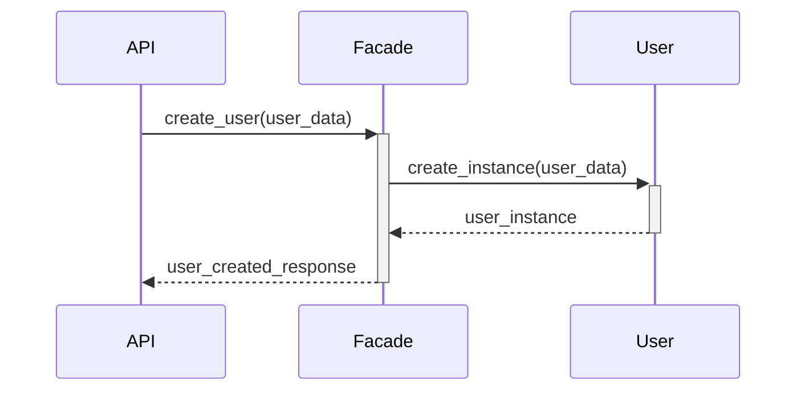

### Task 3: Implement the User Endpoints

#### Objective
Implement the API endpoints needed for managing users in the HBnB application. This task involves setting up CRUD operations (Create, Read, Update) for users, ensuring that these endpoints are integrated with the Business Logic layer. The `DELETE` operation will **not** be implemented for users in this part of the project. Additionally, when retrieving user data, the password should **not** be included in the response. The API interface, return format, and status codes must be clearly defined since black-box testing will be performed later.

For this task, detailed guidance is provided specifically for implementing the user registration (`POST`) functionality, including a simulated email uniqueness check. The approach for the remaining endpoints (e.g., `GET` and `PUT`) follows similar principles and should be implemented analogously. The same applies to the other entities (e.g., Place, Review, Amenity).

In this task, you will:
1. Set up the `POST`, `GET`, and `PUT` endpoints for managing users.
2. Implement the logic for handling user-related operations in the Business Logic layer.
3. Integrate the Presentation layer (API) and Business Logic layer, utilizing the repository pattern.

#### Instructions

1. **Set Up the User Endpoints in the Presentation Layer (API)**
   - In the `api/v1/users.py` file, define the following endpoints:
     - `POST /api/v1/users/`: Register a new user.
     - `GET /api/v1/users/<user_id>`: Retrieve details of a specific user.
     - `PUT /api/v1/users/<user_id>`: Update user information.
     - `GET /api/v1/users/`: Retrieve all users.

   **Detailed Guidance for Implementing the `POST /api/v1/users/` Endpoint:**

   Below is the code for implementing the user registration endpoint with a simulated email uniqueness check. You should follow a similar approach for the other endpoints and entities.

   ```python
   from flask_restx import Namespace, Resource, fields
   from app.services.facade import HBnBFacade

   api = Namespace('users', description='User operations')

   user_model = api.model('User', {
       'first_name': fields.String(required=True, description='First name of the user'),
       'last_name': fields.String(required=True, description='Last name of the user'),
       'email': fields.String(required=True, description='Email of the user')
   })

   facade = HBnBFacade()

   @api.route('/')
   class UserList(Resource):
       @api.expect(user_model)
       @api.response(201, 'User successfully created')
       @api.response(400, 'Email already registered')
       @api.response(400, 'Invalid input data')
       def post(self):
           """Register a new user"""
           user_data = api.payload

           # Simulate email uniqueness check (to be replaced by real validation with persistence)
           existing_user = facade.get_user_by_email(user_data['email'])
           if existing_user:
               return {'error': 'Email already registered'}, 400

           # Validate input data
           if not all([user_data.get('first_name'), user_data.get('last_name'), user_data.get('email')]):
               return {'error': 'Invalid input data'}, 400

           new_user = facade.create_user(user_data)
           return {'id': str(new_user.id), 'message': 'User created successfully'}, 201

       def get(self):
           """Get a list of all users"""
           users = facade.get_all_users()
           return [{'id': str(user.id), 'first_name': user.first_name, 'last_name': user.last_name, 'email': user.email} for user in users], 200

   @api.route('/<user_id>')
   class UserResource(Resource):
       @api.response(200, 'User details retrieved successfully')
       @api.response(404, 'User not found')
       def get(self, user_id):
           """Get user details by ID"""
           user = facade.get_user(user_id)
           if not user:
               return {'error': 'User not found'}, 404
           return {'id': str(user.id), 'first_name': user.first_name, 'last_name': user.last_name, 'email': user.email}, 200

       @api.expect(user_model)
       @api.response(200, 'User updated successfully')
       @api.response(404, 'User not found')
       @api.response(400, 'Invalid input data')
       def put(self, user_id):
           """Update a user's information"""
           user_data = api.payload
           updated_user = facade.update_user(user_id, user_data)
           if not updated_user:
               return {'error': 'User not found'}, 404
           return {'message': 'User updated successfully'}, 200
   ```

   **Explanation:**
   - The `POST` endpoint registers a new user and performs a simulated check for email uniqueness.
   - If the email is already registered, the API returns a 400 status code with an error message.
   - If input data is missing or invalid, a 400 status code is returned with a relevant error message.
   - The password is **not** included in the user data returned by the API.
   - The Facade handles all interactions between layers.

2. **Implement the User Management Logic in the Business Logic Layer**
   - In the `models/user.py` file, the `User` class should already be implemented from Task 2. Ensure that the class can handle updates.

   **Placeholders for Facade Methods:**
   ```python
   def create_user(self, user_data):
       user = User(**user_data)
       self.user_repo.add(user)
       return user

   def get_user(self, user_id):
       return self.user_repo.get(user_id)

   def update_user(self, user_id, user_data):
       return self.user_repo.update(user_id, user_data)

   def get_user_by_email(self, email):
       # Simulated check for existing email (to be replaced by persistence logic)
       return self.user_repo.get_by_attribute('email', email)

   def get_all_users(self):
       return self.user_repo.get_all()
   ```

   **Explanation:**
   - The `create_user` method in the Facade handles user creation, while the `get_user_by_email` method simulates email uniqueness validation.

3. **General Implementation for the Other Endpoints (GET, PUT)**
   - For the `GET` and `PUT` operations, you should follow a similar pattern. Implement the necessary logic in the Facade and Business Logic layer to retrieve and update users. The process is analogous to the implementation of the `POST` endpoint.

4. **Input and Output Formats, Status Codes**

   For each endpoint, you must ensure that the input format, output format, and status codes are consistent and clearly defined:

   - **POST /api/v1/users/** (Register a new user)
     - **Input:**
       ```json
       {
           "first_name": "John",
           "last_name": "Doe",
           "email": "john.doe@example.com"
       }
       ```
     - **Output:**
       ```json
       {
           "id": "3fa85f64-5717-4562-b3fc-2c963f66afa6",
           "message": "User created successfully"
       }
       ```
     - **Status Codes:**
       - `201 Created`: When the user is successfully created.
       - `400 Bad Request`: If the email is already registered or input data is invalid.

   - **GET /api/v1/users/** (Retrieve a list of all users)
     - **Output:**
       ```json
       [
           {
               "id": "3fa85f64-5717-4562-b3fc-2c963f66afa6",
               "first_name": "John",
               "last_name": "Doe",
               "email": "john.doe@example.com"
           },
           ...
       ]
       ```
     - **Status Codes:**
       - `200 OK`: When the list of users is successfully retrieved.

   - **GET /api/v1/users/<user_id>** (Retrieve a user’s details)
     - **Output:**
       ```json
       {
           "id": "3fa85f64-5717-4562-b3fc-2c963f66afa6",
           "first_name": "John",
           "last_name": "Doe",
           "email": "john.doe@example.com"
       }
       ```
     - **Status Codes:**
       - `200 OK`: When the user is successfully retrieved.
       - `404 Not Found`: If the user does not exist.

   - **PUT /api/v1/users/<user_id>** (Update a user’s information)
     - **Input:**
       ```json
       {
           "first_name": "Jane",
           "last_name": "Doe",
           "email": "jane.doe@example.com"
       }
       ```
     - **Output:**
       ```json
       {
           "message": "User updated successfully"
       }
       ```
     - **Status Codes:**
       - `200 OK`: When the user is successfully updated.
       - `404 Not Found`: If the user does not exist.
       - `400 Bad Request`: If input data is invalid.

5. **Testing the Endpoints**
   - Once the endpoints are implemented, use tools like Postman or cURL to test each operation:
     - **POST**: Register a new user.
     - **GET**: Retrieve a user’s details using their ID.
     -

Here's the continuation of Task 3, picking up where it was cut off:

---

5. **Testing the Endpoints**
   - Once the endpoints are implemented, use tools like Postman or cURL to test each operation:
     - **POST**: Register a new user.
     - **GET**: Retrieve a user’s details using their ID.
     - **PUT**: Update a user’s information.
     - **GET**: Retrieve a list of all users.

   **Example Test Using cURL:**
   ```bash
   curl -X GET "http://127.0.0.1:5000/api/v1/users/<user_id>"
   ```

   **Expected Response:**
   ```json
   {
       "id": "3fa85f64-5717-4562-b3fc-2c963f66afa6",
       "first_name": "John",
       "last_name": "Doe",
       "email": "john.doe@example.com"
   }
   ```

6. **Document the User Endpoints**
   - Update the documentation to describe each endpoint:
     - Path, HTTP method, expected payload, and response.
     - How to handle errors (e.g., user not found).

#### Sequence Diagram: Visualizing the Flow of User Registration

For this task, a detailed sequence diagram is provided for the user registration process:



This diagram shows the interaction between the API, Facade, and Business Logic layer when registering a new user.

#### Resources

1. **Flask-RESTx Documentation:** [https://flask-restx.readthedocs.io/](https://flask-restx.readthedocs.io/)
2. **Testing REST APIs with cURL:** [https://everything.curl.dev/](https://everything.curl.dev/)
3. **Designing RESTful APIs:** [https://restfulapi.net/](https://restfulapi.net/)

#### Expected Outcome

By the end of this task, you should have fully implemented the core user management endpoints, including the ability to create, read, and update users. The `DELETE` operation will not be implemented for users in this part. The provided implementation guide for the user registration endpoint should serve as a model for implementing the remaining user endpoints as well as endpoints for other entities (e.g., Place, Review, Amenity). The functionality should be documented and tested, ensuring that all user-related operations are handled smoothly within the HBnB application.
